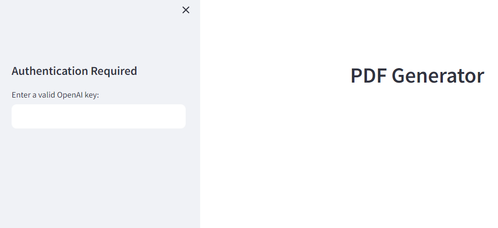
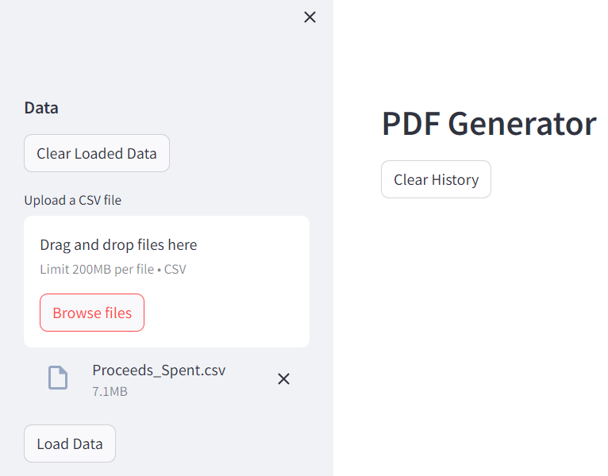
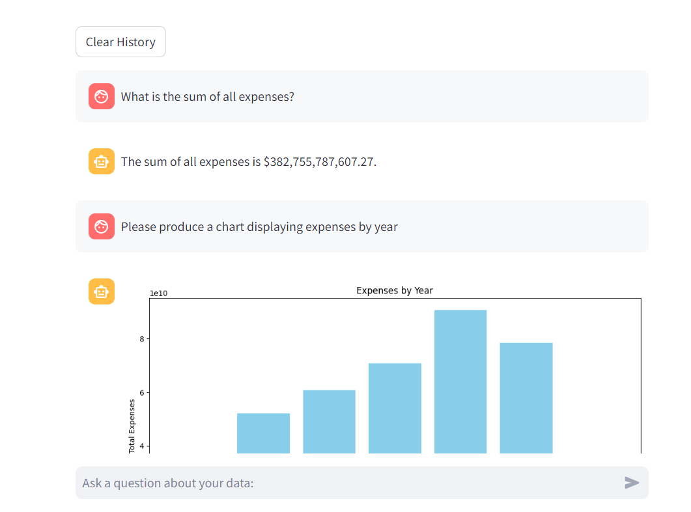
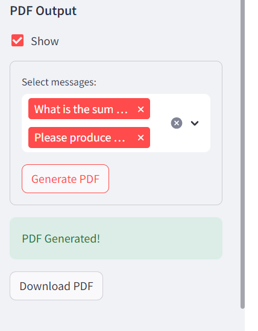

# PDF-Generator
This app enables a non-technical user to upload one or more CSV files, ask questions about the data, and generate a PDF report with selected answers to those questions. Prompts can generate properly formatted sentences, tables, and charts. The app is built using [Streamlit](https://streamlit.io/), [PandasAI](https://github.com/gventuri/pandas-ai) and [OpenAI](https://openai.com/).

### Usage Guide
1. If not set as an environment variable, please enter your OpenAI API key when prompted. Only valid API keys will be accepted.


2. Upload one or more CSV files. Once all have been uploaded, click "Load Data" to load the data into your current session. If you no longer want to use a file, click "Clear Loaded Data" to remove it from your session.


3. Ask all the questions you want about your dataset! If you want to clear the displayed history, click "Clear History". Note: This will also clear the history of the chatbot, so it will not remember the context of previous questions.


4. Once you are satisfied with your questions, click "Show" in the PDF Output section to select the parts of the converstation that you would like to add to your PDF report. Hover over the options to see a preview of the question and provided answer. Once you have selected all the parts you want, click "Generate PDF", and finally "Download PDF" to download your report.


### Original Use Case
As a user I should be able to upload a data set, ask questions about my data and export my data into a pdf. The goal is to provide users the ability to generate transparency reports and chat with AI on my data to build the following, [transparency report example](https://transparency.fb.com/sr/india-monthly-report-jul31-2023/#:~:text=Between%201st%20and%2030th%20June,received%20under%20the%20following%20categories.&text=Of%20these%20incoming%20reports%2C%20we,their%20issues%20in%203%2C507%20cases)

## Using the App in the Cloud
The app is currently deployed and free for use on Streamlit Cloud. You can access it [here](https://automated-analysis.streamlit.app/), no setup required!

## Setting up the App Locally
### Setting up Developer Environment
Set up a virtual environment and install dependencies.

**Installation**

```
pip install -r requirements.txt
```
**OpenAI Key**

At current, the OpenAI API is the only supported way to use this app. You will need to set up an account and get an API key. Once you have an API key, you can set it as an environment variable in a .env file in the "/scripts" directory of the project. The .env file should look like this:

```
OPENAI_API_KEY= 'your key here'
```
Otherwise, upon running the app, you will be prompted to enter your API key.

*To increase privacy, all data analysis takes place locally (or in the remote streamlit environment) and only metadata is sent to OpenAI.*

**Other Large Language Models**

While not currently implemented, an lmstudio_connector.py script has been included in the scripts directory. When integrated, this script will allow you to use the LMStudio tool to enable open source llm models from HuggingFace. These will be created as Langchain LLMs which are able to be utilized by PandasAI within the app. Pull requests to integrate this script into the app or to integrate any other tools are welcome!

### Contribution guidelines

We welcome changes, feel free to contribute! We use commit messages for automated generation of project changelog. For every pull request we request contributors to be compliant with the following commit message notation.

```
<type>: <summary>

<body>
```

Accepted <type> values:

- new = newly implemented user-facing features
- chg = changes in existing user-facing features
- fix = user-facing bugfixes
- oth = other changes which users should know about
- dev = any developer-facing changes, regardless of new/chg/fix status

Summary (The first line)
The first line should not be longer than 75 characters, the second line is always blank and other lines should be wrapped at 80 characters.
